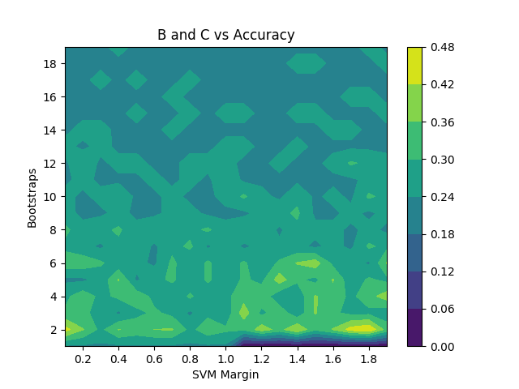
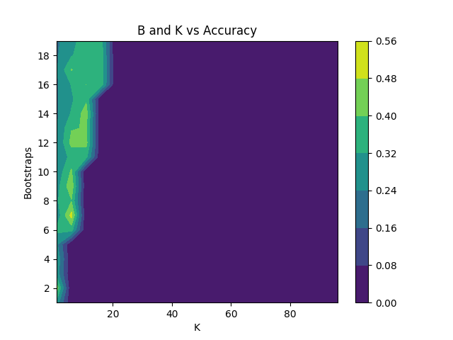

# Details
dataset/data.txt:

    Contains the cleaned and combined data. Each line is a sample, consisting of
    the word, its 50-dimensional GloVe representation, and whether it is a noun.
    These values are space-separated.

source/bootstrapping.py:

    ...

source/clean.py:

    Uses glove50.txt, pos.txt, and common.txt to generate data.txt. As the input
    files are too large for github, they are omitted from this repository.

source/KMeans.py:

    ...

source/probclearn.py:

    ...

source/probcpredict.py:

    ...

source/sample-usage.py:

    ...

source/SVM.py:

    ...
# Results

